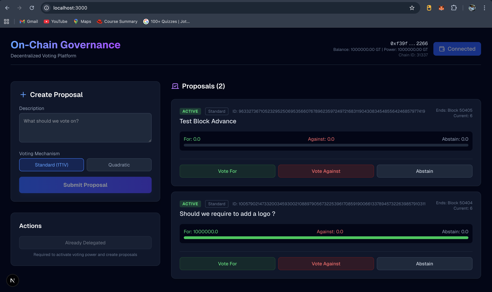
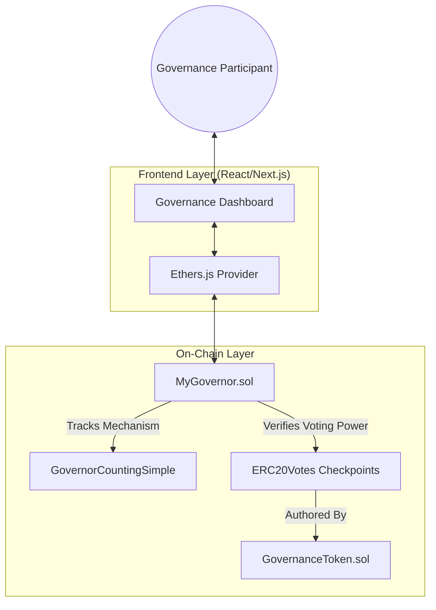
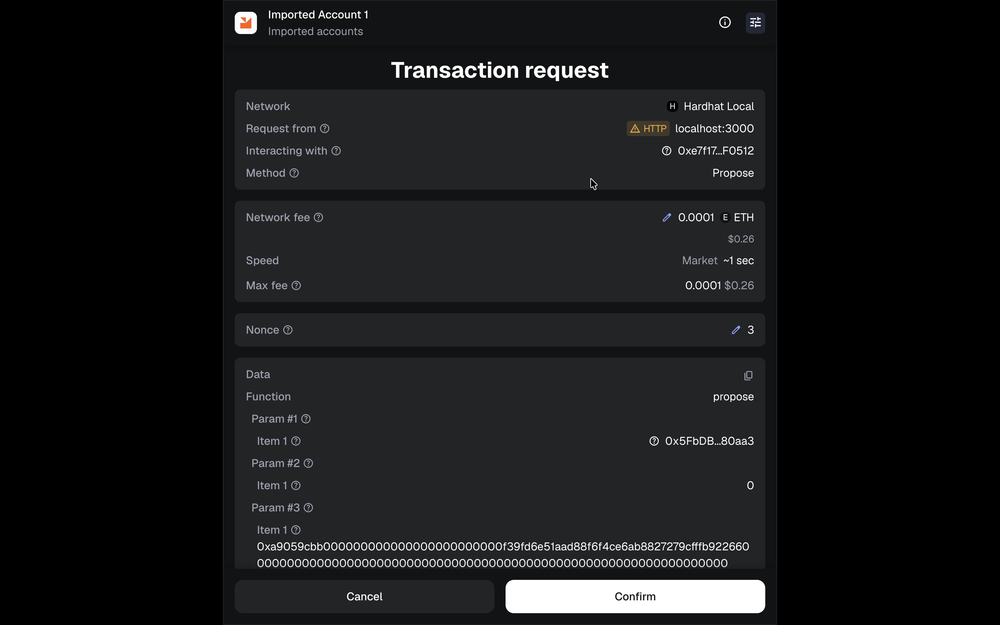

# Decentralized On-Chain Governance Infrastructure

A high-integrity Decentralized Autonomous Organization (DAO) framework designed for secure on-chain decision-making. The platform integrates ERC-20 based governance with dual voting modalities: Standard (1T1V) and Quadratic Voting (QV). Built on the OpenZeppelin Governor standard, it ensures modularity, security, and scalability.


*Figure 1: The primary Governance Dashboard. This interface provides real-time visibility into active proposals, user voting power, and current proposal states (Active, Defeated, Succeeded). It allows users to seamlessly toggle between Standard and Quadratic voting modes during proposal creation.*

## System Architecture



## Core Technical Specifications

### Voting Mechanisms

1.  **Standard Voting**: 
    - Operates on a linear 1 Token = 1 Vote basis.
    - Utilizes delegated voting power snapshots at the proposal creation block.

2.  **Quadratic Voting (QV)**:
    - Designed to mitigate plutocratic influence by implementing a concave utility function for voting power.
    - **Mathematical Model**: $Cost = \frac{Votes^2}{10^{18}}$
    - Participants use a voting power budget determined at the proposal snapshot.
    - All calculations are performed on-chain using 18-decimal precision to ensure mathematical integrity and prevent scaling overflows.

    **Cost Examples:**
    | Desired Votes | Token Cost (Voting Power) |
    | :--- | :--- |
    | 1 Vote | 1 Token |
    | 5 Votes | 25 Tokens |
    | 10 Votes | 100 Tokens |
    | 100 Votes | 10,000 Tokens |

### Security Implementation

- **Proposal Threshold Enforcement**: Validates that only users with sufficient delegated voting power (default: 1000 Tokens) can initiate proposals.
- **Access Control**: Implements `Ownable` and `Pausable` patterns for emergency administrative oversight.
- **Resource Protection**: Integrated `ReentrancyGuard` on all state-changing voting and proposal functions.
- **Gas Efficiency**: Utilizes Custom Errors to reduce transaction overhead and improve on-chain revert clarity.

## Deployment Guide

Follow these steps to deploy the local governance infrastructure for development and testing.

### Prerequisites

- **Docker Desktop**: Required for container orchestration.
- **Node.js (v18+)**: Needed for local script execution (optional if using Docker).
- **MetaMask**: Browser extension for blockchain interaction.

### Step 1: Initialize the Infrastructure

The entire stack (Hardhat Node + Next.js Frontend) is containerized for immediate deployment.

```bash
# Start all services in detached mode
docker-compose up --build -d
```

- **Blockchain Node**: accessible at `http://localhost:8545` (Chain ID: 31337)
- **Web Interface**: accessible at `http://localhost:3000`

*> Note: The automated deployment script creates 1,000,000 Governance Tokens (GT) and assigns them to the default deployer account.*

### Step 2: Configure MetaMask

To interact with the local blockchain, you must configure a custom network in MetaMask.

1.  Open MetaMask Settings → Networks → **Add Network Manually**.
2.  **Network Name**: `Hardhat Local`
3.  **RPC URL**: `http://127.0.0.1:8545`
4.  **Chain ID**: `31337`
5.  **Currency Symbol**: `GO`
6.  Click **Save**.

**Import Testing Account:**
Import the default Hardhat account to access the pre-minted tokens:
- **Private Key**: `0xac0974bec39a17e36ba4a6b4d238ff944bacb478cbed5efcae784d7bf4f2ff80`
- **Balance**: 10,000 ETH (Testnet)

### Step 3: Operational Workflow

**1. Delegate Voting Power**
Before voting, ERC-20 checkpoints must be activated.
- Connect your wallet to the dashboard.
- Click the **"Delegate to Self"** button. This snapshots your balance for voting eligibility.

**2. Create a Proposal**
- Click **"Create Proposal"**.
- Enter a description (e.g., "Protocol Upgrade v2").
- Select your voting mechanism: **Standard** (1T1V) or **Quadratic**.
- Submit the transaction to on-chain storage.

**3. Cast a Vote**
- Once a proposal is mined (Active state), click **Vote**.
- For Quadratic proposals, enter the numeric vote weight. The system will auto-calculate the power cost ($Votes^2$).


*Figure 2: MetaMask Transaction Confirmation. This validation screen confirms the exact contract function being called (`castQuadraticVote`), ensuring transparency and security before the user signs the transaction.*

## Protocol Verification

To validate the mathematical integrity of the governance logic, execute the unified test suite:

```bash
# Run internal tests via Docker
docker-compose exec hardhat-node npx hardhat test

# Expected Output:
# ✓ calculates cost accurately for 10 vote units
# ✓ reverts on insufficient voting power budget
# ... (7 passing)
```

## Repository Structure

```text
├── contracts/          # Solidity Smart Contracts (v0.8.24)
│   ├── GovernanceToken.sol
│   └── MyGovernor.sol
├── frontend/           # Next.js 14 Web Application
│   ├── app/            # Architecture-aligned Pages & Components
│   └── src/artifacts/  # Compiled ABIs & Deployment Addresses
├── scripts/            # Protocol Deployment & Flow Verification scripts
├── test/               # Unified Hardhat Integration Suite
├── docker-compose.yml  # Container Orchestration
└── hardhat.config.js   # Blockchain Development Configuration
```

## License

This project is licensed under the MIT License.
