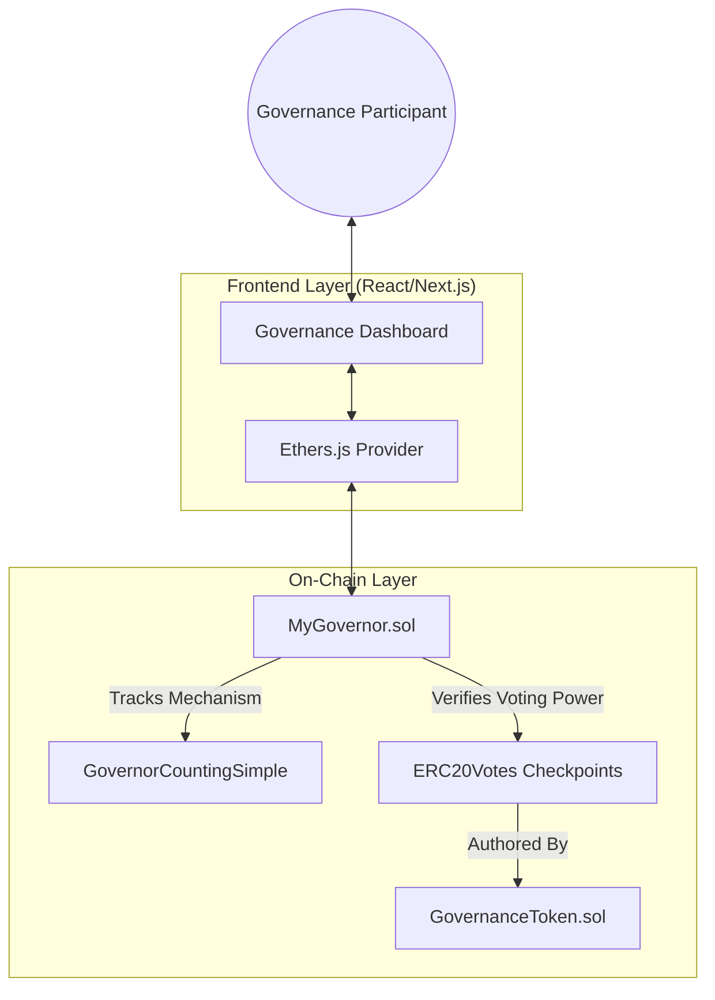

# Decentralized On-Chain Governance Infrastructure

A high-integrity Decentralized Autonomous Organization (DAO) framework designed for secure on-chain decision-making. The platform integrates ERC-20 based governance with dual voting modalities: Standard (1T1V) and Quadratic Voting (QV). Built on the OpenZeppelin Governor standard, it ensures modularity, security, and scalability.

## System Architecture



## Core Technical Specifications

### Voting Mechanisms

1.  **Standard Voting**: 
    - Operates on a linear 1 Token = 1 Vote basis.
    - Utilizes delegated voting power snapshots at the proposal creation block.

2.  **Quadratic Voting (QV)**:
    - Designed to mitigate plutocratic influence by implementing a concave utility function for voting power.
    - **Mathematical Model**: $Cost = \frac{Votes^2}{10^{18}}$
    - Participants use a voting power budget determined at the proposal snapshot.
    - All calculations are performed on-chain using 18-decimal precision to ensure mathematical integrity and prevent scaling overflows.

### Security Implementation

- **Proposal Threshold Enforcement**: Validates that only users with sufficient delegated voting power (default: 1000 Tokens) can initiate proposals.
- **Access Control**: Implements `Ownable` and `Pausable` patterns for emergency administrative oversight.
- **Resource Protection**: Integrated `ReentrancyGuard` on all state-changing voting and proposal functions.
- **Gas Efficiency**: Utilizes Custom Errors to reduce transaction overhead and improve on-chain revert clarity.

## Repository Structure

```text
├── contracts/          # Solidity Smart Contracts (v0.8.24)
│   ├── GovernanceToken.sol
│   └── MyGovernor.sol
├── frontend/           # Next.js 14 Web Application
│   ├── app/            # Architecture-aligned Pages & Components
│   └── src/artifacts/  # Compiled ABIs & Deployment Addresses
├── scripts/            # Protocol Deployment & Flow Verification scripts
├── test/               # Unified Hardhat Integration Suite
├── docker-compose.yml  # Container Orchestration
└── hardhat.config.js   # Blockchain Development Configuration
```

## Technical Stack

- **Blockchain Environment**: Solidity ^0.8.24, Hardhat
- **Smart Contract Standards**: OpenZeppelin Governor (GovernorSettings, GovernorVotes, GovernorVotesQuorumFraction)
- **Frontend Infrastructure**: Next.js 14, Tailwind CSS, Lucide React
- **Client-Chain Interaction**: Ethers.js v6

## Getting Started

### Prerequisites

- Docker Desktop
- Node.js (v18+)
- MetaMask Browser Extension

### Deployment via Docker (Recommended)

To initialize the entire infrastructure (node + frontend + contract deployment), execute:

```bash
docker-compose up --build
```

The node will be available at `http://localhost:8545` (Chain ID: 31337) and the dashboard at `http://localhost:3000`.

## Protocol Verification

To execute the unified integration suite and verify the governance logic:

```bash
# Internal container execution
docker-compose exec hardhat-node npx hardhat test

# Local execution
npm install
npx hardhat test
```

## License

This project is licensed under the MIT License.

